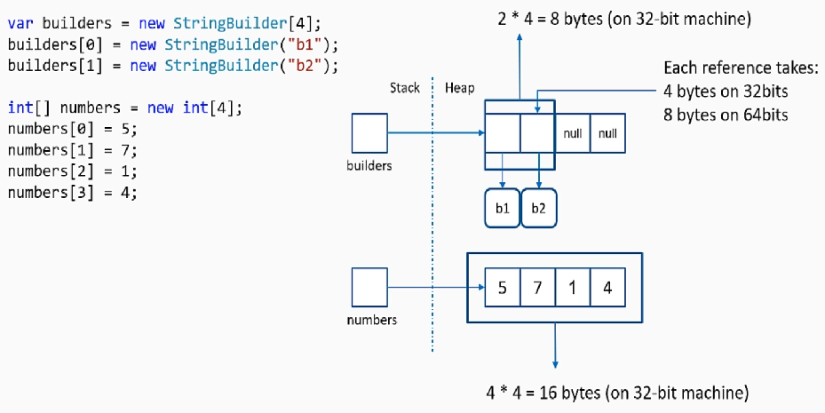
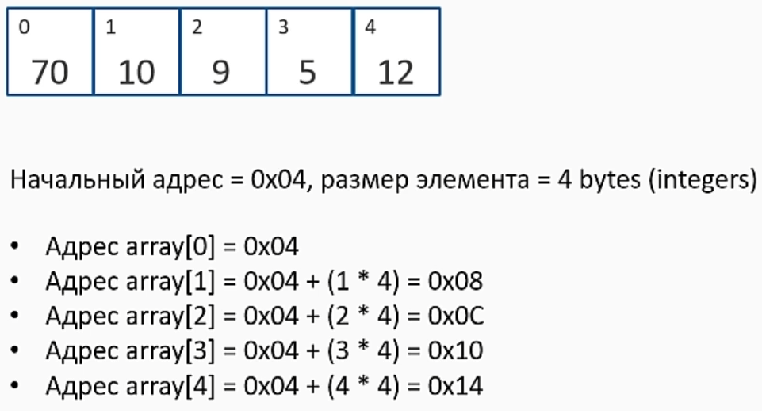
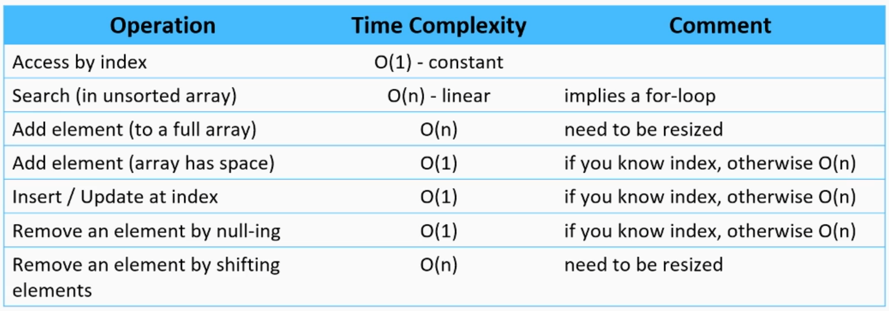

**Массивы** в памяти. (Все массивы ссылочные типы)

    - SyncBlockIndex (4 bytes) + ref to method table (4 bytes) + Length (4 bytes)
    - Массивы 4-х целых чисел ест (4*4 bytes + 12 bytes) = 28 bytes
    - Массив ссылочных типов также содержит TypeHandle, т.о. пустой массив строк съест: SyncBlockIndex (4 bytes) + method table ref (4 bytes) + Length (4 bytes) + TypeHandle (4 bytes) = 16 bytes

Узнать адрес в памяти элемента массива

Самые часты операции с массивами:
 - Доступ к элементу: или прямой если возможно, или с предварительным поиском
 - Добавление элемента: в начало, в конец
 - Вставка элемента
 - Обновление элемента
 - Удаление элемента

