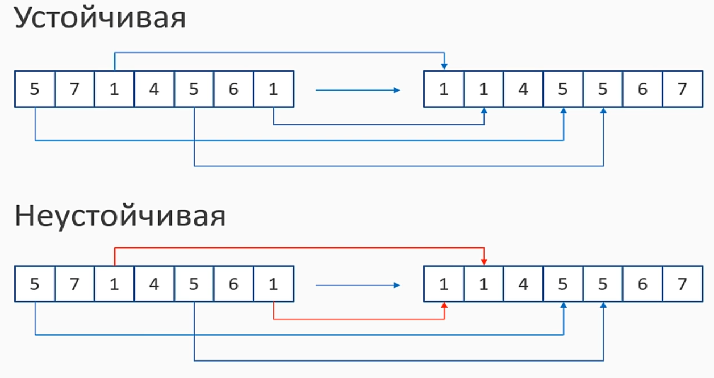

- **In-Place алгоритм** - использует малое количество доп. памяти (не зависит от N)

- Стабильна/Нестабильная сортировка. (Устойчивая/Неустойчивая)


Например, если поставить ```>=``` вместо ```>``` то, получим нестабильный алгоритм.

```CSharp
        public static void BubbleSort(int[] array)
        {
            for (int partIndex = array.Length - 1; partIndex > 0; partIndex--)
            {
                for (int i = 0; i < partIndex; i++)
                {
                    if (array[i] >= array[i + 1])
                    {
                        Swap(array, i, i + 1);
                    }
                }

            }
        }
```


**Пузырьковая сортировка:** - In-Place алгоритм; Стабильный; O(N^2) временная сложность; быстрая деградация из-за квадратичной сложности.

**Сортировка выборкой** - In-Place алгоритм; Нестабильный(неустойчивый); O(n^2) временная сложность (квадратичная), быстрая деградация (при этом чуть быстрее пузырьковой сортировки)

**Сортировка вставками** - In-Place; Стабильный(устойчивый); O(n^2); быстрая деградация; Если массив почти отсортирован, но сложность будет линейной.

**Сортировка Шелла (Shell Sort)** - основана на сортировке вставками; Сортировка вставками эффективна на "почти отсортированном массиве"; **Основная идея**: предварительно отсортировать (специальным образом) и переключиться на сортировку вставками; Для предварительной сортировки используется **gap** - позволяет обменять местами далеко отстоящие друг от друга элементы; Сортировка Шелла начинается с большого **gap** и постепенно его уменьшаем; Когда **gap = 1**, процесс переключается на сортировку вставками.

- Производительность зависит от выбранных значений gap
- в 99% случаев вы можете полагаться на "универсальную" последовательность gap значений
- Применение "универсальной" последовательности:
1. Вычисление начальной (максимальной) gap:
  ```CSharp
  int gap = 1;
  while (gap < array.Length / 3 >)
        gap = 3 * gap + 1;
  ```
1. Сокращать gap в конце каждой итерации внешнего цикла:
  ```CSharp
  while (gap >= 1) {
    // sorting
    // ...
    gap /= 3;
  }
  ```
  - Это даёт следующую последовательность: 1, 4, 13, 40, 121, 364, ... (1/2(3^k - 1))

**Shell Sort** - In-Place; Нестабильный (неустойчивый); O(N^3/2) в ременная сложность если gap-последовательность: 1/2(3^k - 1); Можно даже достичь O(N^6/5);

**Сортировка слиянием** - Принцип "разделяй и властвуй"; Две фазы: разделение и слияние; Разделение чисто логическое: предоставляет организованный способ построить последовательность слияний.

**Сортировка слиянием** Не **In-Place**: требует много доп. памяти (зависит от N); **Стабильный** (устойчивый) в классической реализации; O(NlogN) (линейно-логарифмическая)

**Быстрая Сортировка** - Разделяй и властвуй, Рекурсивный, Базируется на выборе опорного элемента; Элементы < опорного идут влево от него; Элементы > опорного идут вправо от него; Опорный элемент находит своё место в конце каждого прохода.

**Быстрая Сортировка**  - In-Place (использует малое кол.доп.памяти(не зависит от N)); O(NlogN); O(N^2) - редкий случай, но возможный; Нестабильная сортировка.