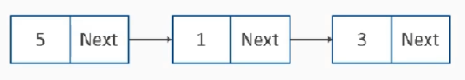
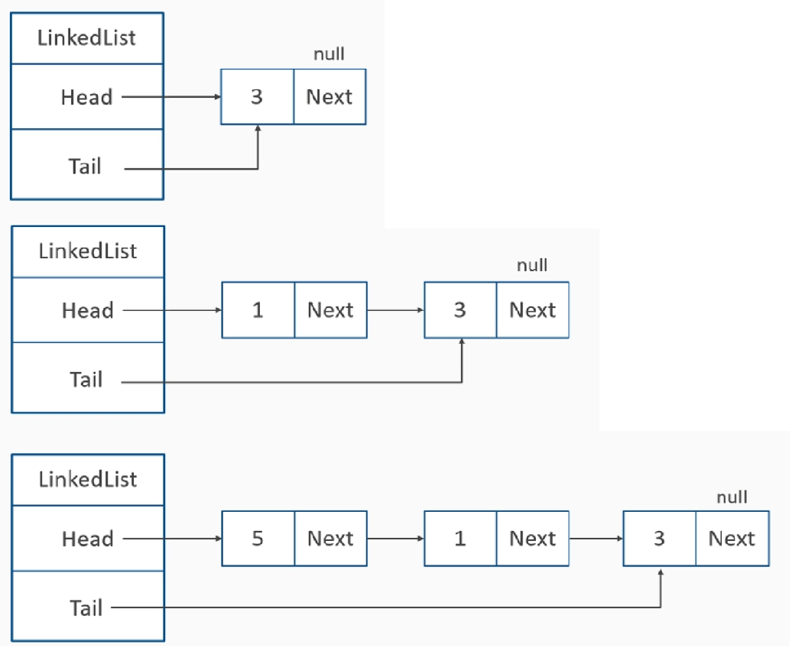
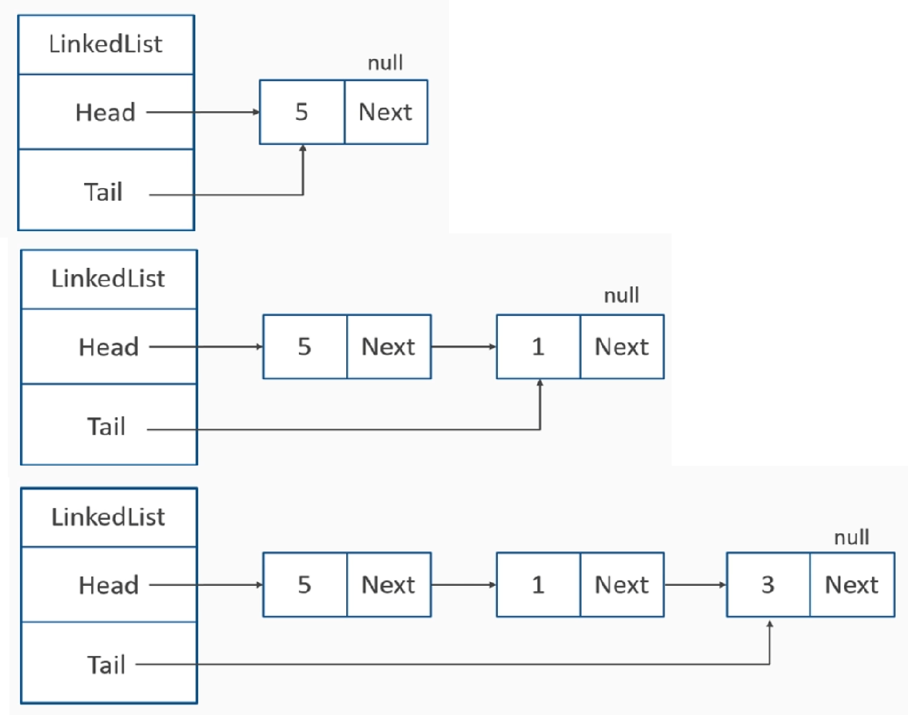
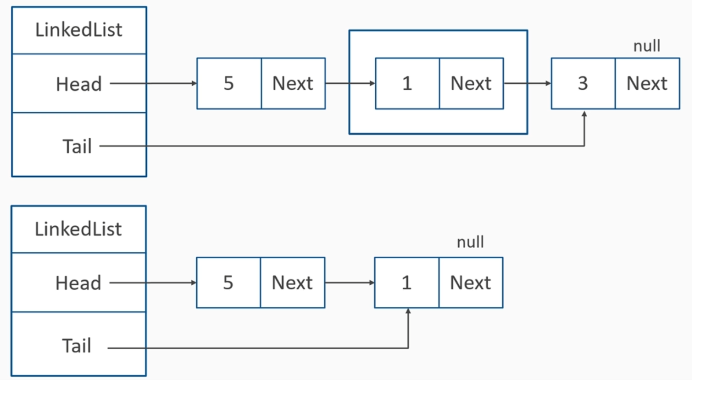
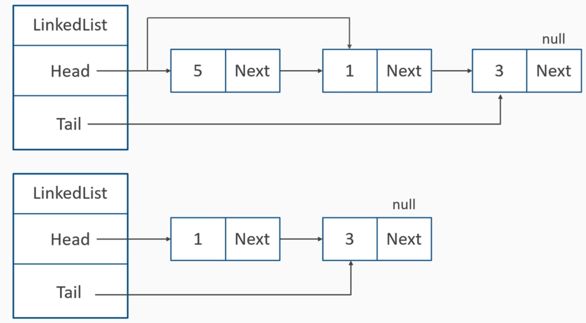
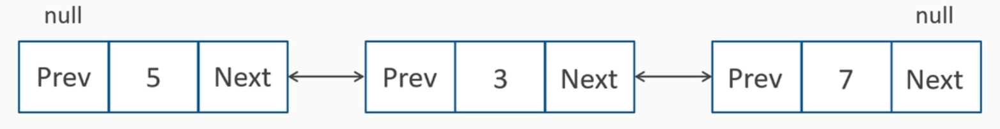

### LinkedList
Node Chains

     - Head - первый элемент
     - Tail - последний узел
     - Операции:
       - Add
       - Remove
       - Find
       - Enumerate

### Singly-Linked List
AddFirst

AddLast

RemoveLast

RemoveFirst

### Doubly-Linked List

### Встроенный LinkedList это:
    - Doubly-Linked Circular List
    - AddFirst/AddLast - O(1)
    - AddBefore/AddAfter - O(1)
    (if you know the node, otherwise you'll have to search at first for O(N))
    - Remove O(N) - searching
    - RemoveFirst/RemoveLast O(1) 
    - Contains, Find/FindLast O(N)
    - CopyTo - O(N)
    - Clear - O(N) // чтобы зачистить все ссылки