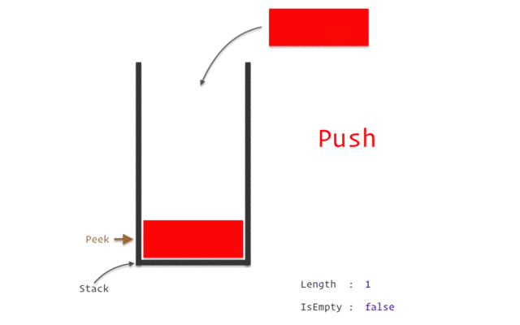

### Stack
- Абстрактный тип данных (АТД)
- Реализует LIFO - Last-In First-Out

Операции:

    - Push  - добавить элемент
    - Pop   - удалить элемент
    - Peek  - взять верхний элемент без его удаления
- Может базироваться на массиве или связанном списке

- Peek - O(1)
- Если базируются на связанном списке: Push/Pop - O(1)
- Если на массиве, то:
    - достаточно слотов Push - O(1)
    - недостаточно, Push - O(N)
    - Pop всегда работает за O(1) если мы не сужаем массив; O(N) - сужаем
- Если на устройстве достаточно памяти или макс. кол-во элементов неизвестно -> связанный список можно предпочесть массиву в качестве основы для стека.
- Если недостаточно памяти -> массив.

Хотя, на практике, из за особенности работы с массивами, вполне может быть так, что стек, основанный на массиве, работает быстрее, чем стек на связанном списке.

### BCL Stack
 - Based on Array
 - Peek/Pop O(1)
 - Push O(N) when resizing, otherwise O(1)
 - Contains, Find/FindLast - O(N) - have to traverse N nodes
 - CopyTo - O(N)
 - Clear - O(N)
 - TrimExcess - O(N) Если используется <=90%