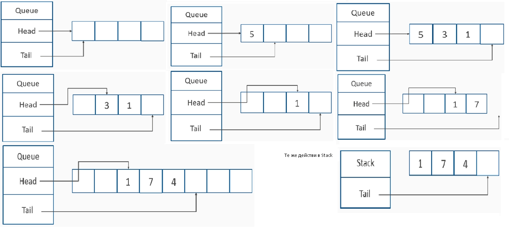
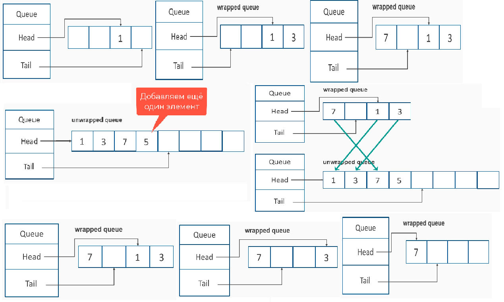

### Queue
- FIFO - Fist-In, First-Out
- Enqueue - добавление элементов в конец очереди
- Dequeue - удаление элементов из начала очереди
- Peek - взятие элемента из начала очереди без удаления

- Peek - O(1)
- Если на основе списка Dequeue/Enqueue - O(1)
- Если на массиве:
  - достаточно места - О(1)
  - недостаточно Enqueue O(N), Dequeue O(1)-не сужаем массив, O(N) сужаем.

Выбор реализации такой же как и у Stack

**Queue**

**Кольцевая очередь**

### BCL Queue
- Кольцевая и базируется на массиве
- **Фактор роста** - число на которое умножается текущая ёмкость при необходимости расширения. Определяется в момент конструирования очереди. По умолчанию = 2. Ёмкость очереди расширяется минимум на 4 элемента независимо от фактора роста. Например, если фактор роста = 1, то очередь всегда будет расширяться на 4 элемента.
- Хотя, клиент не может управлять фактором роста!
- Подлежащий массив всегда будет расти в два раза.

- Peek/Dequeue - O(1)
- Enqueue O(N) при расширении, иначе O(1)
- Contains O(N) проход по N узлам
- CopyTo / ToArray - O(N)
- Clear - O(N)
- TrimToSize -O(N)