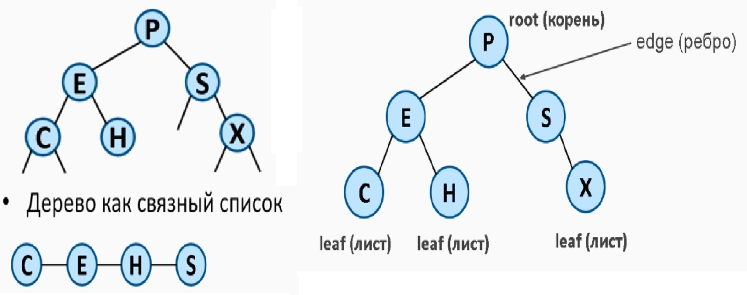
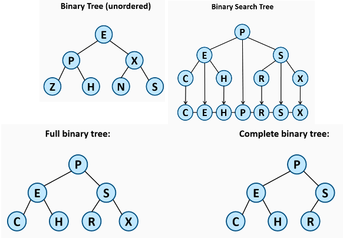
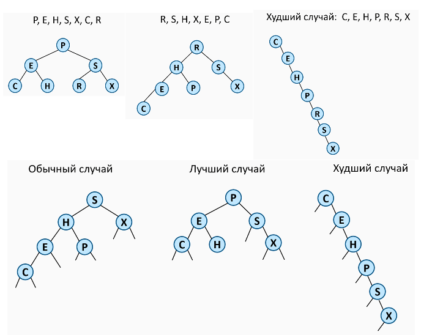
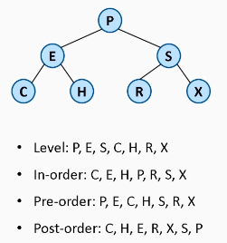
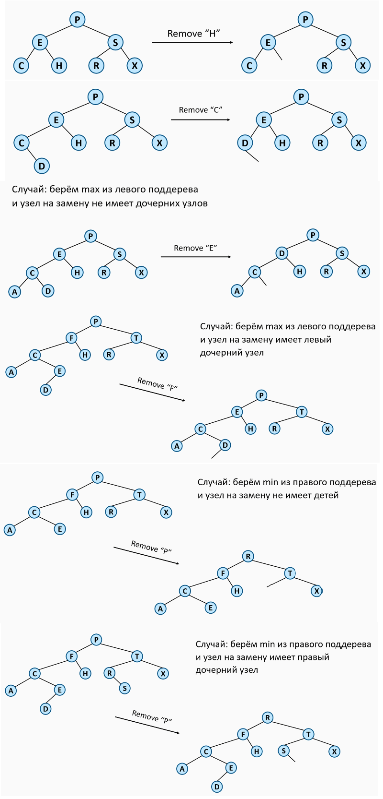

## Дерево (Tree)
- Дерево это и АТД и структура данных

## Бинарное дерево (Binary Tree)
- Каждый узел имеет 0, 1 или 2 дочерних узлов
- Левый и Правый дочерние узлы
- Бинарное дерево поиска (Binary Search Tree (BST)) используется на практике

- Левый дочерний < Родителя
- Правый дочерний > Родителя
- Левое поддерево содержит только значения меньше Родителя
- Правое поддерево содержит только значения больше Родителя
- Бинарный поиск даёт log(N) для вставки, удаления, извлечения.

## Порядок обхода BST

## Удаление из BST
- Узел - лист
- Узел имеет один дочерний узел
- Узел имеет два дочерних узла:
  - выбрать узел на замену из левого или правого поддерева.

