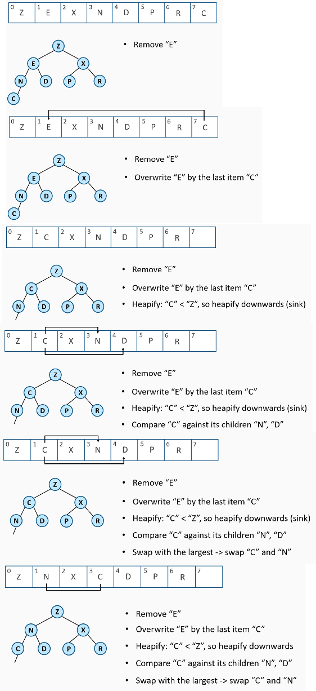

### Heap (Куча - пирамида)
- Heap is a special case of binary tree
- Binary Tree should be Complete
- Max Heap: every parent >= children (max is at the root)
- Min Heap: every parent <= children (min is at the root)
- Heap are implemented as arrays
- Heapifying - the process of converting a binary tree into a heap (happens at insertion and removal)
- No conditions between siblings

#### Пирамида как массив:
- Корнем становиться array[0]
- Проходя по дереву, мы добавляем в массив значения на каждом уровне слева направо.

#### Вставка в пирамиду
- Добавить элемент в конец массива
- Затем "Heapify"
    - сравнить добавленный элемент с родителем
    - если элемент > родителя - поменять их местами
    - повторять пока элемент не занял своё место.

#### Удаление из пирамиды
- Необходима замена удаляемому элементу
- Чтобы сохранять дерево в состоянии "complete", берем самое правое значение (rightmost value)
- Затем "Heapify":
    - if replacement > parent -> fix upwards (swim)
    - if replacement < parent -> fix downwards (sink)

### Heap Performance
- Insert O(log(n))
- Remove Max\Min O(log(n))
- Peek O(1)
- if you need random access - use other data structures

### Heap Sort
- Основана на концепции "пирамиды"
- Случайный ввод необходимо сконцентрировать в Пирамиду перед запуском "пирамидальной сортировки"
- Heap Sort - O(n*log(n))
- In-Place (потребление памяти не зависит от N)
- Нестабильная (Неустойчивая)
- В большинстве случаев, **QSort** быстрее (в 5 - 10 раз)
- В жизненно-важных сценариях, когда N^2 недопустим - положитесь на HeapSort (или совместно QSort + HSort = IntroSort)