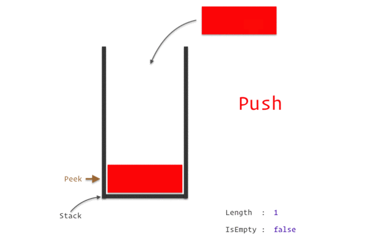

**Абстрактный тип данных (АТД)** - математическая модель для типа дынных, где тип данных определяется поведение (семантикой) с точки зрения пользователя дынных, а именно в терминах возможных значений, возможных операций над данными этого типа и поведения этих операций.
- АТД - абстрактное описание того как набор данных может быть организован и какие операции могут над ними производиться.
- АТД может описывать стек как тип данных, который позволяет хранить данные и проводить операции ``` Push, Pop, Peek ```.

**Структура данных** - это способ организации данных, управления ими и их хранения, обеспечивающий эффективный доступ к данным и их модификацию.
_Структура данных_ - это коллекция значений, взаимоотношения между ними и операции, производимые над этими данными.
- Структура данных - конкретная реализация АТД
- Структуры данных строятся на примитивных типах данных (int, string, и т.д.)

*Стек имеет абстрактное определение и конкретную реализацию.* (например: стек построенный на массиве или стек на связанно списке)



**Алгоритм** - корректно определённая вычислительная процедура, имеющая входные и выходные данные.
**Алгоритм** - последовательность шагов по трансформации входных данных в выходные.
**Алгоритм** нужны для решения корректно определенных вычислительных проблем
**Алгоритм** всегда формализован и однозначно определяет вычислительную процедуру для достижения желаемых результатов.

**Алгоритм** включает:
- описание корректного ввода
- полное описание вычислительных шагов
- описание корректного вывода

**Временная сложность**
(**сколько времени надо** для решения? **сколько памяти нужно** для решения проблемы?)
Основная проблема: определить **частоту выполнения каждой инструкции** и попытаться сократить частоту на сколько это возможно.

**Аппроксимация или приближение** — научный метод, состоящий в замене одних объектов другими, в каком-то смысле близкими к исходным, но более простыми. Аппроксимация позволяет исследовать числовые характеристики и качественные свойства объекта, сводя задачу к изучению более простых или более удобных объектов.

Асимптотические нотации:
- θ средний случай (Ну как средний... есть нюансы);  
- О большое - самый худший случай алгоритма;
- Ω лучший случай;

(сложность алгоритма, который не зависит от входных данных, O(1) - константна)